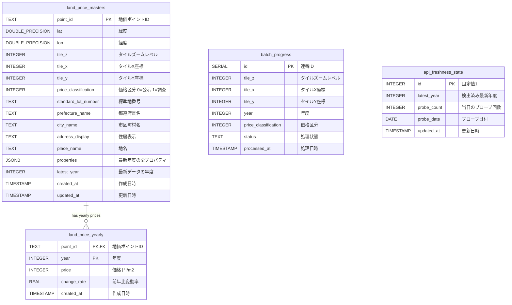
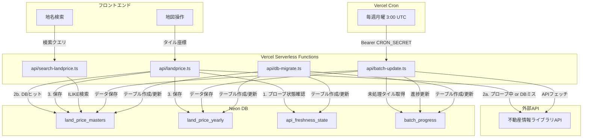

# データベース設計書

本ドキュメントは、land-price-map アプリケーションのデータベース設計を定義するものです。

- **DBMS**: PostgreSQL（Neon Serverless）
- **接続**: `@neondatabase/serverless` パッケージ経由
- **無料枠**: ストレージ 0.5GB

---

## ER図



---

## テーブル詳細

### 1. `land_price_masters` -- 地価ポイントマスター

地点ごとに1行。不変情報（住所、道路、法規制等）と最新年度のフルプロパティを保持する。

| カラム | 型 | NULL | デフォルト | 説明 |
|--------|-----|------|-----------|------|
| `point_id` | TEXT | NO | - | **PK** 不動産情報ライブラリのポイントID |
| `lat` | DOUBLE PRECISION | NO | - | 緯度（WGS84） |
| `lon` | DOUBLE PRECISION | NO | - | 経度（WGS84） |
| `tile_z` | INTEGER | NO | - | タイルズームレベル（13を使用、約4km×4km/タイル） |
| `tile_x` | INTEGER | NO | - | タイルX座標 |
| `tile_y` | INTEGER | NO | - | タイルY座標 |
| `price_classification` | INTEGER | NO | - | 0=地価公示, 1=都道府県地価調査 |
| `standard_lot_number` | TEXT | YES | NULL | 標準地番号（例: 千代田-1） |
| `prefecture_name` | TEXT | YES | NULL | 都道府県名 |
| `city_name` | TEXT | YES | NULL | 市区町村名（市郡名+区町村名を結合） |
| `address_display` | TEXT | YES | NULL | 住居表示 |
| `place_name` | TEXT | YES | NULL | 地名 |
| `properties` | JSONB | NO | - | 最新年度のAPIレスポンス全プロパティ |
| `latest_year` | INTEGER | NO | - | この地点で保持している最新の年度 |
| `created_at` | TIMESTAMP | YES | NOW() | レコード作成日時 |
| `updated_at` | TIMESTAMP | YES | NOW() | レコード更新日時 |

**インデックス**:
- `idx_masters_tile` ON `(tile_z, tile_x, tile_y, price_classification)` -- タイル検索用
- `idx_masters_place_trgm` ON `place_name` USING gin(gin_trgm_ops) -- あいまい検索用
- `idx_masters_coords` ON `(lat, lon)` -- 座標検索用

---

### 2. `land_price_yearly` -- 年度別価格

1地点あたり最大5行（過去5年分）。価格と変動率のみを保持する軽量テーブル。

| カラム | 型 | NULL | デフォルト | 説明 |
|--------|-----|------|-----------|------|
| `point_id` | TEXT | NO | - | **PK** マスターへの外部キー |
| `year` | INTEGER | NO | - | **PK** 年度 |
| `price` | INTEGER | YES | NULL | 価格（円/m²） |
| `change_rate` | REAL | YES | NULL | 前年比変動率（%） |
| `created_at` | TIMESTAMP | YES | NOW() | レコード作成日時 |

**制約**:
- PRIMARY KEY `(point_id, year)`
- FOREIGN KEY `point_id` REFERENCES `land_price_masters(point_id)`

**インデックス**:
- `idx_yearly_point` ON `(point_id, year DESC)` -- 価格履歴取得用

---

### 3. `batch_progress` -- バッチ処理進捗

Vercel Cron Jobs によるバッチ更新の進捗を管理する。

| カラム | 型 | NULL | デフォルト | 説明 |
|--------|-----|------|-----------|------|
| `id` | SERIAL | NO | auto | PK |
| `tile_z` | INTEGER | NO | - | タイルズームレベル |
| `tile_x` | INTEGER | NO | - | タイルX座標 |
| `tile_y` | INTEGER | NO | - | タイルY座標 |
| `year` | INTEGER | NO | - | 年度 |
| `price_classification` | INTEGER | NO | - | 価格区分 |
| `status` | TEXT | YES | `'pending'` | `pending` / `completed` / `error` |
| `processed_at` | TIMESTAMP | YES | NULL | 処理完了日時 |

**制約**:
- UNIQUE `(tile_z, tile_x, tile_y, year, price_classification)`

---

### 4. `api_freshness_state` -- API鮮度管理

シングルトンテーブル（常に1行のみ）。毎日の最新年度プローブ状態を管理する。

| カラム | 型 | NULL | デフォルト | 説明 |
|--------|-----|------|-----------|------|
| `id` | INTEGER | NO | `1` | PK（CHECK id = 1 で1行に限定） |
| `latest_year` | INTEGER | NO | `2025` | 検出された最新データの年度 |
| `probe_count` | INTEGER | NO | `0` | 当日のAPI直接問い合わせ回数 |
| `probe_date` | DATE | NO | CURRENT_DATE | プローブカウントの基準日 |
| `updated_at` | TIMESTAMP | YES | NOW() | 最終更新日時 |

**動作**:
- 毎日最初の5リクエストは、DBの有無に関わらずAPIに直接問い合わせ
- API応答に新しい年度のデータが含まれていれば `latest_year` を更新
- 日付が変わると `probe_count` を `0` にリセット

---

## データフロー図



---

## ストレージ見積もり

| テーブル | 行数（全国5万地点x5年想定） | 1行あたり | 合計 |
|---------|---------------------------|----------|------|
| `land_price_masters` | 50,000 | ~1.5 KB | ~75 MB |
| `land_price_yearly` | 250,000 | ~30 B | ~7.5 MB |
| `batch_progress` | ~1,800 | ~50 B | ~0.1 MB |
| `api_freshness_state` | 1 | ~50 B | ~0 MB |
| **インデックス（推定）** | - | - | ~15 MB |
| **合計** | - | - | **~98 MB** |

Neon 無料枠 0.5GB に対して約20%の使用率。

旧構造（非正規化）では同じデータが約375MB（75%）を占めるため、正規化により約**4倍のストレージ削減**。

---

## マイグレーション

### 初期マイグレーション

`api/db-migrate.ts` または `scripts/migrate.js` を実行してテーブルを作成。

```bash
# ローカルから直接実行
node scripts/migrate.js

# またはAPIエンドポイント経由（認証キー必要）
curl -X POST "http://localhost:3000/api/db-migrate?key=YOUR_API_KEY"
```

### 旧テーブルからの移行

旧 `land_price_points` テーブルが存在する場合、マイグレーションスクリプトが自動的にデータを移行する。

1. 旧テーブルの各 `point_id` について、最新年度の行を `land_price_masters` に挿入
2. 全年度の価格データを `land_price_yearly` に挿入
3. 移行完了後、旧テーブルを `land_price_points_old` にリネーム（バックアップ）
